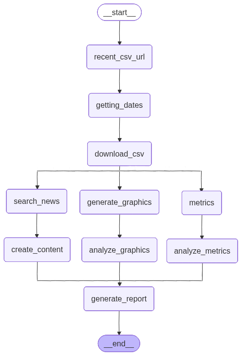

# indicium_academy_ai_eng_certification
This repository contains the code related to the Indicium Academy Certification to the AI Engineer.

# 🦠 Epidemiological Report Generator Agent

## 🌟 Overview

This project implements a sophisticated **Generative AI Agentic Workflow** designed to automate the end-to-end process of generating comprehensive epidemiological situation reports. It seamlessly integrates data sourcing, statistical analysis, graphic generation, and natural language generation (NLG) from large language models (LLMs).

The entire process is orchestrated as a directed acyclic graph (DAG) or a state machine (likely built with **LangGraph** or similar framework), where a central **ReportState** is passed between sequential and parallel processing nodes.

## 💡 Agentic Architecture and Data Flow

The core of this system is the **ReportState** and a series of independent, chained **nodes** (functions) that act as specialized agents or tools. Each node performs a specific task, updates the central state, and hands the control to the next node in the pipeline.


---

## 🛠️ Components

### 1. The Central State: `ReportState`

The `ReportState` is the single source of truth, managing all inputs, intermediate results, and final report content.

<div style="text-align: center;">
    
</div>

### Tools

| Key | Type | Description |
| :--- | :--- | :--- |
| `root_url` | `str` | Initial URL to locate the data source. |
| `download_url` | `str` | Direct link to the raw data file (e.g., CSV). |
| `start_date` | `str` | Start date for data filtering and reporting period. |
| `end_date` | `str` | End date for data filtering and reporting period. |
| `local_path` | `str` | Local path where the downloaded dataset is saved. |
| `query` | `str` | Primary subject/search term for news retrieval (e.g., "Dengue Fever"). |
| `selected_columns` | `list` | Columns necessary for epidemiological rate calculation. |
| `metrics` | `Dict` | Quantitative indicators and calculated rates. |
| `news` | `str` | Raw/processed content from online news searches. |
| `summary` | `str` | AI-generated executive summary. |
| `recent_developments` | `str` | AI-generated synthesis of recent geopolitical/epidemiological events. |
| `perspectives` | `str` | AI-generated outlook or future risk assessment. |
| `desc_metrics` | `str` | Human-readable analysis of the calculated metrics (AI-generated). |
| `desc_12_months` | `str` | Textual description of case trends over the last 12 months (AI-generated from graphics). |
| `desc_30_days` | `str` | Textual description of case trends over the last 30 days (AI-generated from graphics). |

### 2. The Agentic Nodes

The nodes are the functional steps in the pipeline. They utilize specialized **Tools** (like `get_csv_file_details`, `calculate_epidemiology_rates`, `analyze_graphic`, `create_content`) to perform their tasks.

| Node | Function | Tools Used | Description |
| :--- | :--- | :--- | :--- |
| **`node_recent_csv_url`** | Data Sourcing | `get_csv_file_details` | Finds the most current CSV download link from a root page. |
| **`node_getting_dates`** | Pre-processing | `getting_dates` | Extracts the report's date range from the download URL (metadata). |
| **`node_download_csv`** | Data Ingestion | `download_file_if_missing` | Downloads the raw data file locally for processing. |
| **`node_metrics`** | Data Analysis | `calculate_epidemiology_rates` | Calculates key rates (e.g., incidence, mortality) from the dataset. |
| **`node_generate_graphics`** | Visualization | `generate_case_time_series_charts` | Creates and saves time-series plots (e.g., last 12 months, last 30 days). |
| **`node_search_news`** | Context Retrieval | `search_online_news` | Retrieves relevant and recent news articles based on the report's **query** and date range. |
| **`node_analyze_metrics`** | NLG Agent | `analyze_metrics` | Uses an LLM to interpret and generate a descriptive analysis of the calculated numerical metrics. |
| **`node_analyze_graphics`** | Vision Agent | `analyze_graphic` | Uses a Multimodal LLM to analyze the generated time-series charts (PNG/JPEG) and produce textual summaries of the trends. |
| **`node_create_content`** | Synthesis Agent | `create_content` | Uses an LLM to synthesize the **news** articles into structured report sections: **Summary**, **Recent Developments**, and **Perspectives**. |
| **`node_generate_report`** | Output Generation | `generate_pdf_report` | Compiles all generated content (metrics analysis, graphic analysis, news synthesis) into the final PDF document. |

---

## 🚀 Getting Started

### Prerequisites

* Python 3.12+
* LangChain/LangGraph (or similar orchestration framework)
* Access to an LLM/Multimodal model (e.g., Gemini, GPT-4V) for the analysis and content generation steps.
* Required data science libraries (e.g., pandas, matplotlib/seaborn) for data processing and graphics.

### Installation

```bash
git clone [https://github.com/your-repo/epidemiological-report-agent.git](https://github.com/your-repo/epidemiological-report-agent.git)
cd epidemiological-report-agent
pip install -r requirements.txt
```

### Report Generation

Make a copy of the `.env.example` file, fill in the values for your API keys, and rename the copy to `.env`.

```bash
python main.py
```

### Project Structure

.
├── src/
│   ├── tools.py                # Contains all the specialized tool functions (data processing, LLM calls, PDF generation)
│   ├── agent_workflow.py       # Main file defining the ReportState and all the node functions (the code provided)
├── data/
│   └── raw_data.csv            # Placeholder for the downloaded dataset
├── output/
│   ├── graphics/               # Directory for generated PNG/JPEG charts
│   ├── news/                   # Directory for raw news content/summaries
│   └── final_report.pdf        # The final generated epidemiological report
├── README.md                   # This file
└── requirements.txt            # Python dependencies


### Key Stages of the Generation Process

The entire system functions as a pipeline, with each major function acting as a specialized tool for a particular stage of report generation.

### 1. Data Ingestion and Preparation (The Scraper & Data Tool)

This initial stage handles finding and acquiring the raw data:

* get_csv_file_details: Acts as a Web Scraping Agent. Its sole job is to navigate a public health data landing page (root_url), parse the HTML (using BeautifulSoup), and precisely locate the most recent direct download link for the CSV data.

* getting_dates: Extracts the publication date (end_date) directly from the download URL's filename and calculates a corresponding start date (one year prior), establishing the reporting period.

* download_file_if_missing: Acts as a Data Acquisition Tool. It ensures the large raw CSV file is downloaded locally if it doesn't already exist, saving time and bandwidth on subsequent runs.

* generate_case_time_series_charts: Acts as a Visualization Tool. It reads the raw data, performs time-series aggregation, and outputs two essential charts: cases in the last 12 months (monthly bar chart) and cases in the last 30 days (daily line chart).

### 2. Quantitative Analysis (The Data Scientist Tool)

* calculate_epidemiology_rates: Acts as a Statistical Analysis Engine. It calculates crucial public health metrics from the raw data for the recent 30-day period. Key rates include:

* Case Increase Rate (monthly percentage change) [taxa de aumento de casos].

* Case Fatality Rate (CFR) [taxa de mortalidade].

* ICU Occupancy Rate [taxa de ocupação de UTI].

* Population Vaccination Rate (among analyzed cases) [taxa de vacinação da população].

The output is a structured dictionary of numerical results saved to a JSON file.

### 3. Contextual Retrieval (The Intelligence Agent)

* search_online_news: Acts as an External Search Agent (using GoogleSerperAPIWrapper). It performs a targeted, real-time news search related to the primary query and reporting dates, retrieving recent articles and saving the structured results to a JSON file.

### 4. Generative AI Synthesis (The Expert Analyst Agents)

This stage leverages Google's Gemini 2.5 Flash model to transform raw data and news into structured, narrative text.

* analyze_graphic: Acts as a Vision-Powered Analyst. By passing the generated PNG graphic files to the multimodal LLM, it produces two distinct, high-value textual descriptions:

* desc_12_months: Analysis of long-term trends and seasonality.

* desc_30_days: Analysis of recent short-term dynamics and potential immediate implications.

* analyze_metrics: Acts as a Quantitative Analyst. It takes the raw numbers from the metrics dictionary and produces a human-readable, single-paragraph summary analysis of the key epidemiological indicators.

* create_content: Acts as the Geopolitical/Epidemiological Report Synthesizer. It ingests the raw news data and generates the narrative core of the report, structured into:

* Executive Summary.

* Recent Developments (including source citations).

* Perspectives (risk analysis/outlook).

### 5. Final Report Assembly (The Publisher)

* generate_pdf_report: Acts as the Final Publisher/Document Generator (using ReportLab). It takes all the pre-processed components—dates, the Executive Summary, the Metrics Analysis, the Graphic Descriptions, and the Perspectives—and compiles them into the final, professional SRAG Final Report.pdf document. This is the ultimate output object of the entire workflow.

This architecture showcases a high-level Agentic Pattern, where complex reasoning and creation tasks are broken down into simpler, testable steps, each managed by a dedicated, tool-equipped function.
